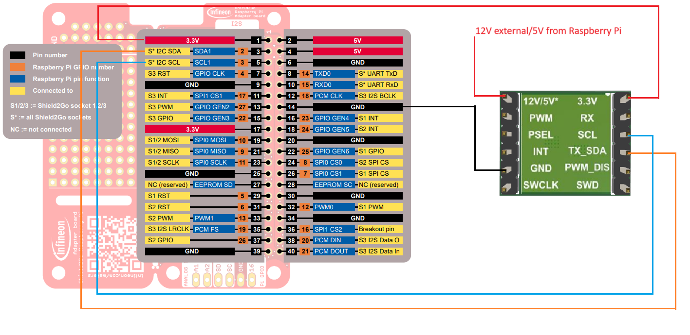

.. _arduino-getting-started:

Getting Started
================

In this quick tutorial we will go through one of the PAS CO2 sensor examples available using the Shield2Go or the Miniboard and Raspberry Pi.

Required Hardware
-----------------

.. list-table::
    :widths: 50 50
    :header-rows: 1

    * - Name
      - Picture
    * - `PAS CO2 Sensor Shield2Go <https://www.infineon.com/cms/en/product/evaluation-boards/shield_pasco2_sensor>`_
      - .. image:: img/pas-co2-s2go-front.jpg
            :height: 60
    * - or `PAS CO2 V01 Miniboard <https://www.infineon.com/cms/en/product/evaluation-boards/eval_pasco2_miniboard>`_
      - .. image:: img/pas-co2-miniboard.jpg
            :height: 80
    * - or `PAS CO2 V15 Miniboard <https://www.infineon.com/cms/en/product/evaluation-boards/eval_co2_5v_miniboard>`_
      - .. image:: img/pas-co2-miniboard_v15.jpg
            :height: 80 
    * - `Raspberry Pi 3/3B+/4B <https://www.raspberrypi.com/>`_
      - .. image:: img/RPi4b.jpg
            :height: 120
    * - Micro-USB to USB A cable 
      -

In case of using the miniboard, the following items are also required:

    * Jumper cables
    * 12V DC power supply for PAS CO2 V01 Miniboard

Required Software
-----------------

* `PAS CO2 Arduino library <https://github.com/Infineon/rpi-pas-co2-sensor>`_

Software Installation
---------------------

0. **Enable I2C in Raspberry Pi configurations**.

1. **Build the project**. Use command  <cmake .> to build the project and <make> to generate the executable

2. **Run the executable**. 

    .. image:: img/rpi-terminal_example.png
        :width: 500

Hardware Setup
--------------

For this example we are going to use the I2C serial interface. 

A. Shield2Go
""""""""""""

If you are using the PAS CO2 Sensor Shield2Go, it just need to be stacked on the `Shield2Go Adapter for Raspberry Pi board <https://www.infineon.com/cms/en/product/evaluation-boards/s2go-adapter-rasp-pi-iot>`_. Be sure that that the corresponding solder jumper are set for I2C mode, and PSEL is pulled to GND. 
Check the `Shield2Go Manual <https://www.infineon.com/cms/en/product/evaluation-boards/shield_pasco2_sensor/#!documents>`_  for complete details.

 
    .. image:: img/raspberry_pi_setup.png
        :width: 600

B. Miniboard
""""""""""""

In order to use the I2C interface we need to add a 10 Kohm pull-up resistors to the SDA and SCL lines, and a 12VDC voltage needs to be additionally provided to VDD12V pin. Connect the boards as shown in the following diagram:

You need to provide a 12V DC signal to for the emitter for V01 miniboard. 
For V15 miniboard the 5V can be provided from Raspberry Pi
 

**Note** |:warning:| : If the pin headers provided are not press-fit you will need to solder them on the corresponding boards. Otherwise, use your preferred way of connecting the hardware. 

Ready To Go!
------------

With everything ready, now we are going to upload and run one of the library examples. 

1. **Build the project**. Use command  <cmake .> to build the project and <make> to generate the executable

2. **Run the executable**. 

    .. image:: img/rpi-terminal_example.png
        :width: 500

.. |ver-but| image:: img/ard-verify-button.png
                :width: 17

.. |upl-but| image:: img/ard-upload-button.png
                :width: 17

What's next?
------------

This is just the start |:rocket:| !

Changes required for switching the communication interface from I2C to UART
ret = begin(true,false);    //First argument enables I2C and the second argument enables UART

Check out the rest of the available :ref:`library examples <lexamples>` and find out more about the library functions in the :ref:`API reference <api-ref>` section.

