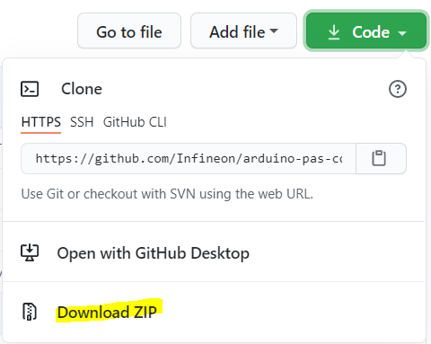

Library Installation
====================

Manual Installation
-------------------

Clone the desired library version from the repository `releases <https://github.com/Infineon/rpi-pas-co2-sensor/releases>`_ section.
git clone --recurse-submodules <link>
 
|:warning:| As a general recommendation, direct downloads from the master branch should be avoided. Even if it should not, it could contain incomplete or faulty code.

    lib_deps =
        infineon/pas-co2-sensor @ ^1.0.3

Find more information in the `PlatformIO Registry <https://platformio.org/lib/show/12518/pas-co2-sensor>`_.
